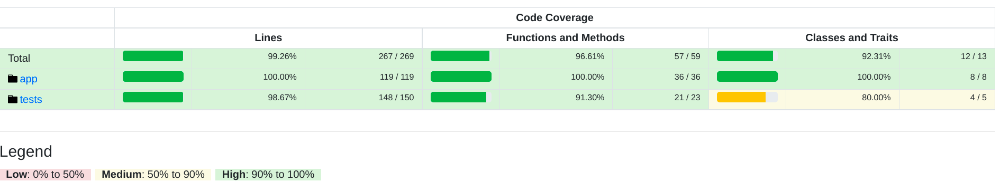

# Robots Simulator

## Test Coverage

## Setup

1. The host computer must be running Docker.

2. Clone this repository:

       git clone https://github.com/nimaamiri92/instapro

3. Change directory into the repository directory:

       cd instapro

4. Build and tag Docker image

       docker build --tag instapro .

5. Install project dependencies:

       docker run --rm -v "$PWD":/var/www -w /var/www instapro php /usr/local/bin/composer install

### Run Simulator
The simulator can be given commands either via the CLI or from a file:

    docker run --rm -v "$PWD":/var/www -w /var/www instapro php runner data/test-1.txt

    docker run --rm -v "$PWD":/var/www -w /var/www instapro php runner data/test-2.txt

### Run Tests
The tests can be run using:

    docker run --rm -v "$PWD":/var/www -w /var/www instapro php vendor/bin/phpunit --coverage-html tests/report

## Development Considerations
The solution to this simulator was developed with solid design principles and strategy pattern.

I decide to separate robot behavior:

      Rotation

      Movement

because in future the robot need to improve, and may extend current behaviors.

Each behavior has Builder and Builder try to call propre activity base on the request.
